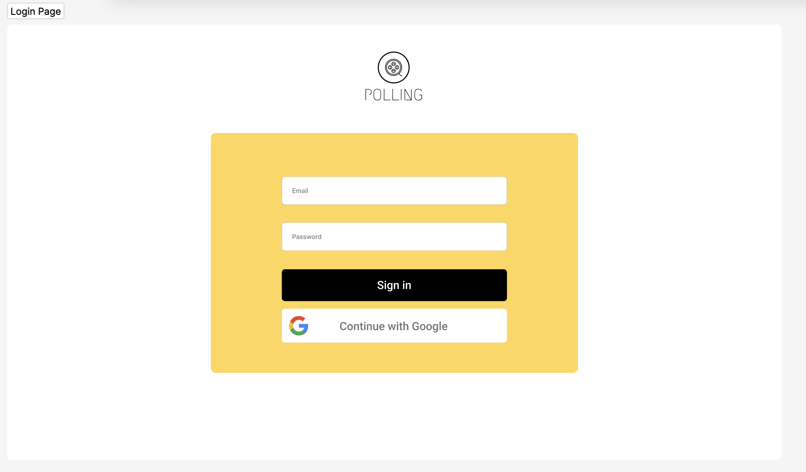
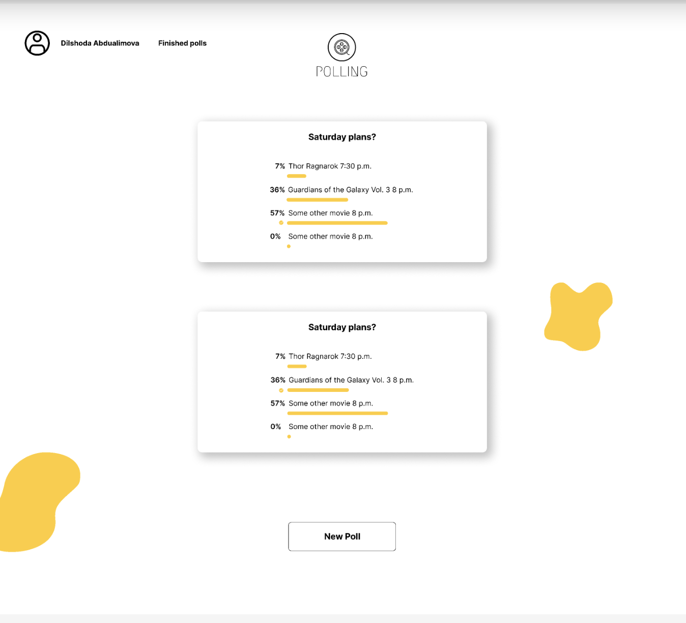
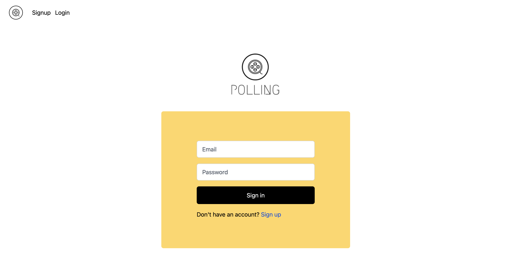
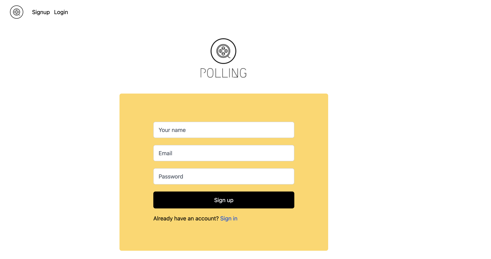
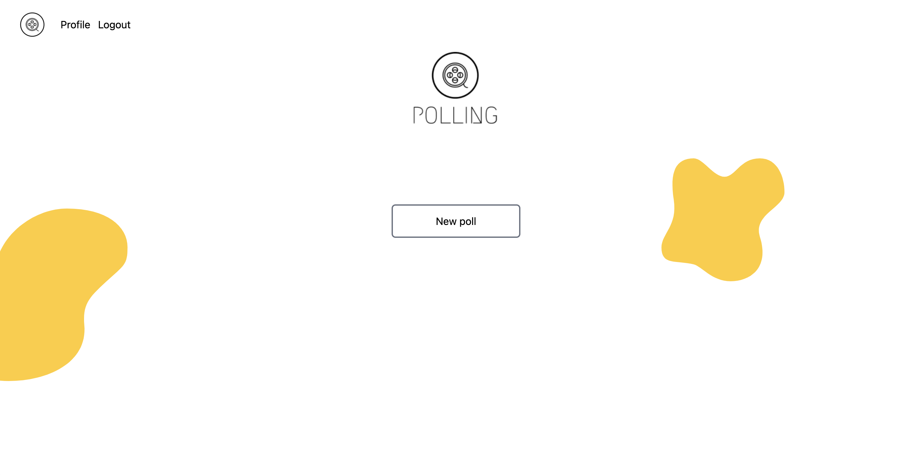
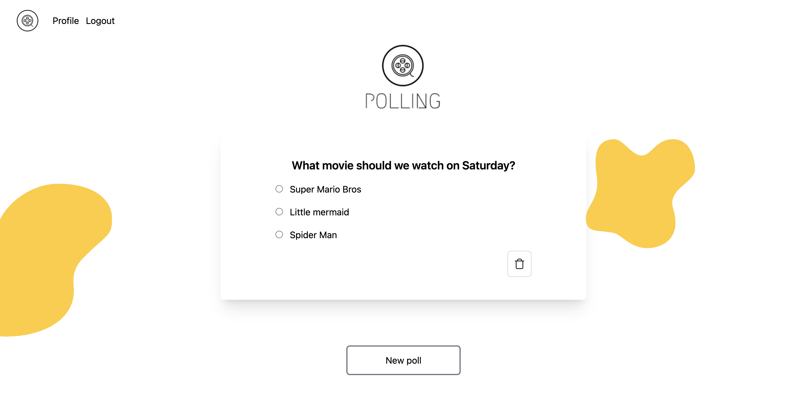
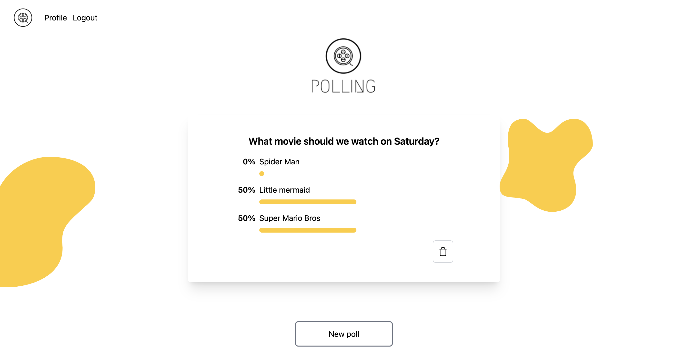
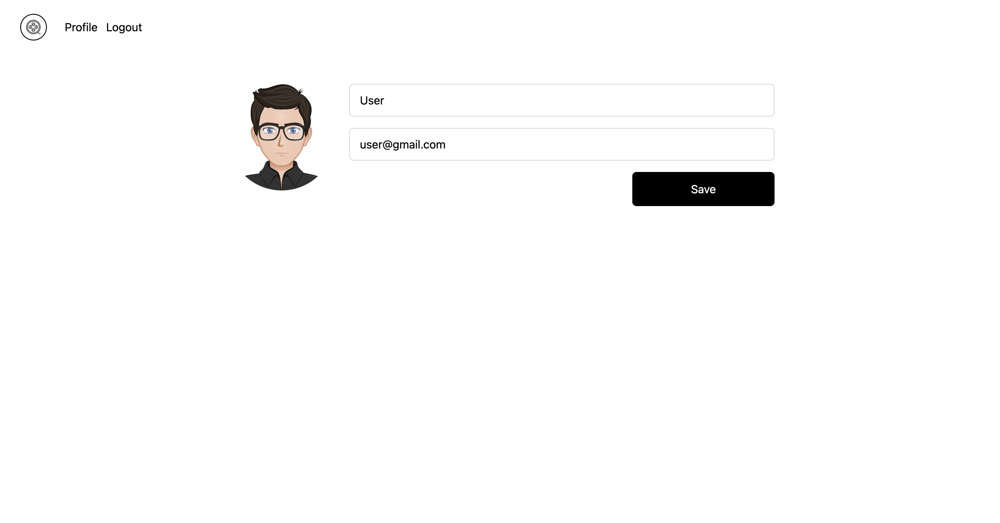

# `Polling`

A polling application to use with friends to vote on topics. Current MVP version of the application uses a movie database API. You and your friends can vote create polls on what movies you'd like to see this weekend.

## How to Install
1. `Fork` and `Clone` this repository in your terminal
2. Run `npm i` in terminal to install dependencies 
3. Run `sequelize db:migrate` in terminal to setup the database
4. Run `npm run dev` to connect to the server
5. Open `http://localhost:3000` in your web browser

## Accessing the Website Online

Visit 

## User Stories
- As a user, I want to sign up and create an account on the website, so that I can access its features and participate in movie voting with my friends.
- As a user, I want to search for movies playing in theaters near me, so that I can see a list of available options for the weekend.
- As a user, I want to see the current voting results, including the number of votes each movie has received, so that I can track the progress of each option.

## Wireframe

Login Page Mockup

Poll Homepage Mockup

## Using the Website
1. Sign up for an account
2. Click on `New Poll`
3. Fill in details of a poll and create your first poll

- To delete a poll, click the trash icon and refresh the page

## Website Screenshots

Login Page

Signup Page

Homepage

Homepage with poll

Homepage with poll and the result

Profile page

## API
SerpAPI

## Languages and Frameworks Used
- JS
- Express JS
- Node JS
- Sequelize
- Postgresql
- MYSQL
- HTML5
- CSS

## Blockers
- Time
- How to create a poll and assign it a url that only people who have the link can access it to be able to vote on it

## Future Goals/Unsolved Problems
1. Improve UI/UX for pulling up API
2. Functionality to pull up movies playing near you
3. Functionality for users to search for polls
4. Functionality for users to vote on other weekend activities through additional APIs

